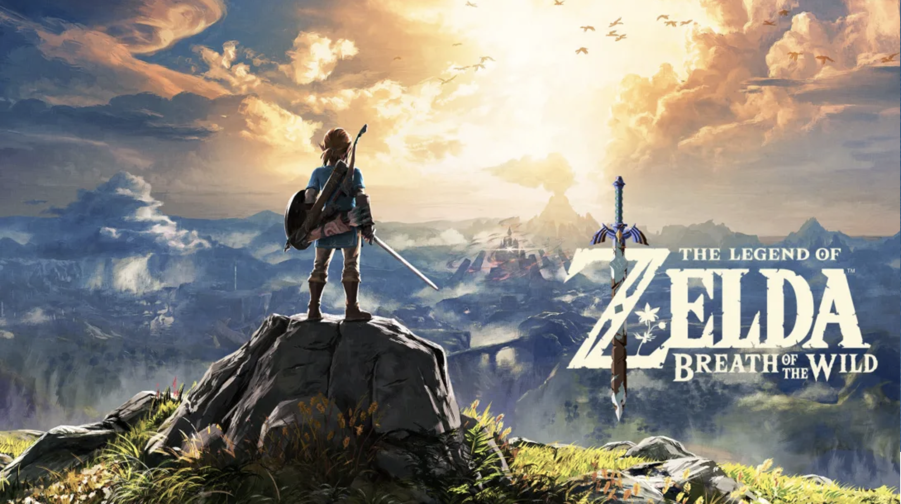

# Introduction

### Me

I am from Zhengzhou, China. Here is a brief introduction of my hometown: [Google Zhengzhou](https://en.wikipedia.org/wiki/Zhengzhou)

**My major is Math-ComputerScience.**

I have great interest in studying CS, 

and my learning philosophy is

> Practice makes perfect.

My favorite code is `Hello world`

I hope I can be a good software engineer in the future.

### My Hobbies

I like traveling, more info refers to [HY travel](hy_travel.md)

I enjoy playing switch, and one classical image of my favorite game is here:

I also like other switch games like:

1. Pokemon Shield
2. Animal Crossing
3. The Elder Scrolls V: Skyrim

My favorite singer is Jay Chou, and I like Chinese pop music the most.

What computer languages I'm familiar with:

- C++
- Java
- Python

### My Wish

My Wish of taking CSE110:

- [ ] make new friends
- [ ] learn something useful
- [x] have a good time

Here is a quick way to the top: [index](#introduction)
